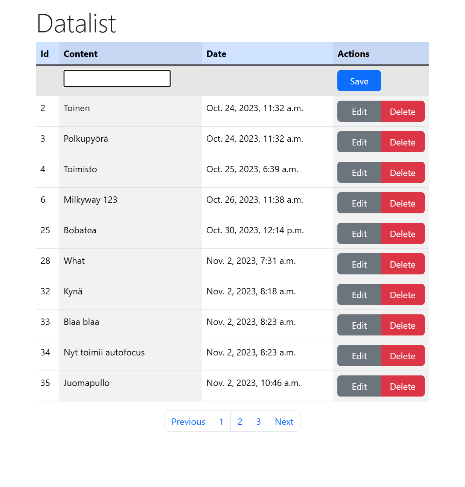
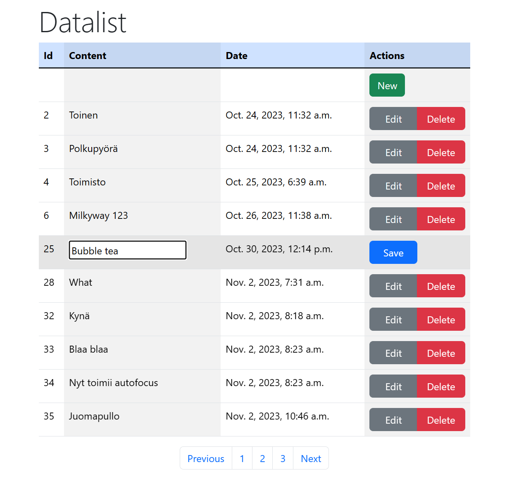

<!-- PROJECT LOGO -->
 

  

  <h3 align="center">Simple Datalist Project</h3>

<!-- ABOUT THE PROJECT -->
## About The Project

Working to understand how to apply CRUD methods in Django.
1. Django connects to an external PostgreSQL databse.
2. Local server redirects immediately to "createdata" app.
3. "Createdata" app allows user to create, edit and delete single-text data from the database.
4. Applied Bootstrap 5 outlook.
5. The webpage autofocuses on the form field.
6. The application divides database data into pages when there are over 10 items in the database. (unfinished)

Examples:

<!-- BUILDWITH -->
### Built With

* PostgreSQL 16
* Django 4.2.7
* Boostrap 5

<!-- ROADMAP -->
## Roadmap

* [ ] User authentication application

...
